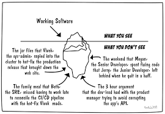
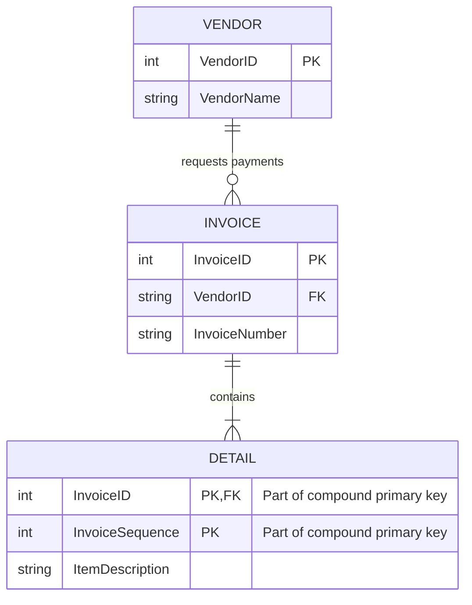

<p align="center">
  
<br />
HL Modern Development
</p>



```mermaid
erDiagram
    VENDOR ||--o{ INVOICE : "requests payments"
    VENDOR {
        int VendorID PK
        string VendorName
    }
    INVOICE ||--|{ DETAIL : contains
    INVOICE {
        int InvoiceID PK
        string VendorID FK
        string InvoiceNumber
    }
    DETAIL {
        int InvoiceID PK,FK "Part of compound primary key"
        int InvoiceSequence PK "Part of compound primary key"
        string ItemDescription
    }
```


```sql
SELECT *
FROM Company
WHERE
  CompanyID = 2;
```
